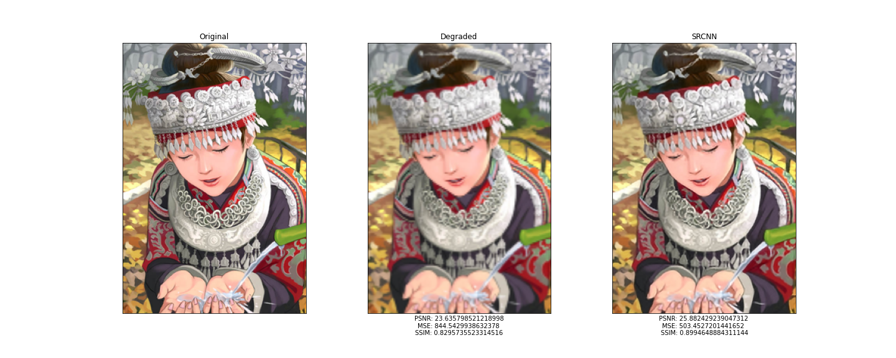
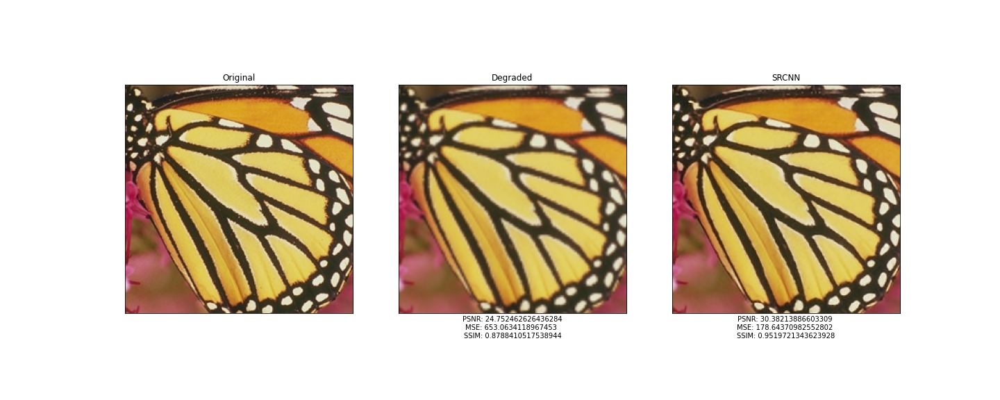
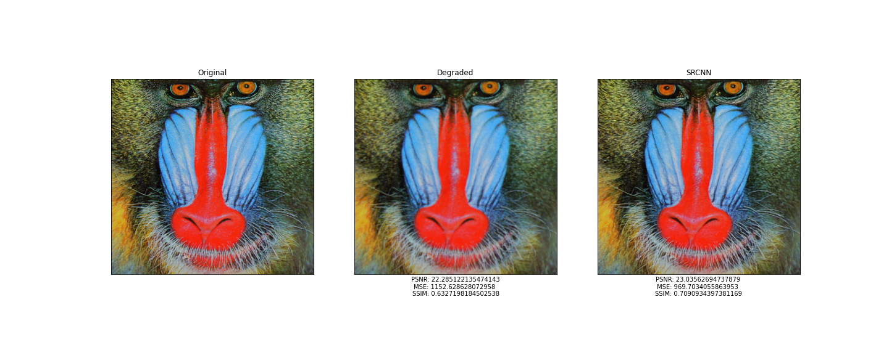
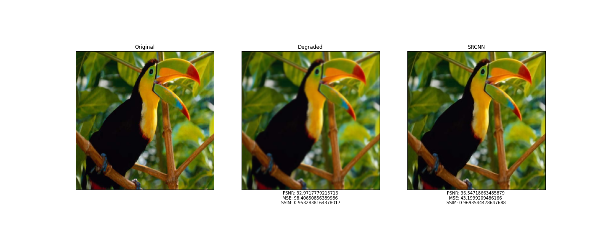
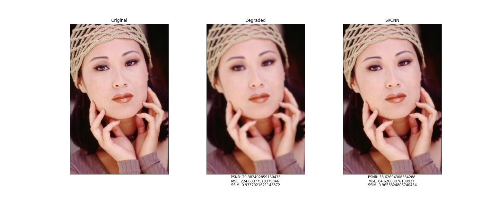

# Image-Resolution
The goal of this project is to recover a high resolution from a low-resolution input.

To accomplish this goal, deployed the super-resolution convolution neural network (SRCNN) using Keras. This network was published in the paper, "Image Super-Resolution Using Deep Convolutional Networks" by Chao Dong, et al. in 2014. You can read the full paper at https://arxiv.org/abs/1501.00092.

As the title suggests, the SRCNN is a deep convolutional neural network that learns end-to-end mapping of low-resolution to high-resolution images. To evaluate the performance of this network, used three image quality metrics were: peak signal to noise ratio (PSNR), mean squared error (MSE), and the structural similarity (SSIM) index.

 
# Results

